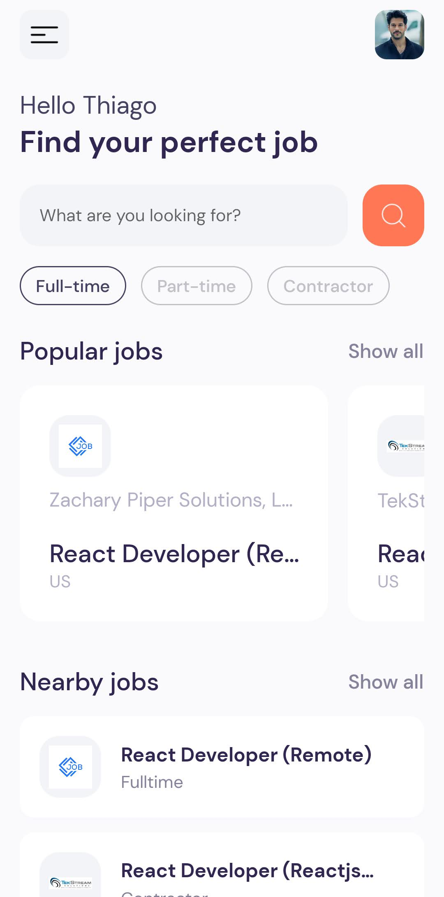

<h1 align="center"> Jobs </h1>

Projeto desenvolvido em React Native, com base nos ensinamentos do vídeo - [Build and Deploy a React Native App | 2023 React Native Course Tutorial for Beginners](https://youtu.be/mJ3bGvy0WAY) do canal [@javascriptmastery](https://www.youtube.com/@javascriptmastery) no Youtube. 

<p align="center">
  <a href="#-tecnologias">🚀 Tecnologias</a>&nbsp;&nbsp;&nbsp;|&nbsp;&nbsp;&nbsp;
  <a href="#-projeto">💻 Projeto</a>&nbsp;&nbsp;&nbsp;|&nbsp;&nbsp;&nbsp;
  <a href="#-instruções"> 📋 Instruções</a>&nbsp;&nbsp;&nbsp;|&nbsp;&nbsp;&nbsp;
  <a href="#-layout">🔖 Layout</a>&nbsp;&nbsp;&nbsp;|&nbsp;&nbsp;&nbsp;
  <a href="#-licença">📝 Licença</a>
</p>

<br>

<p align="center">
  
</p>

## 🚀 Tecnologias

Esse projeto foi desenvolvido com as seguintes tecnologias:

- [NodeJS](https://nodejs.org/)
- [Rapid API](https://rapidapi.com/hub)
- [React Native](https://reactnative.dev/)


<br>

## 💻 Projeto

Jobs trata-se de um aplicativo que visa facilitar a busca de oportunidades de emprego para Desenvolvedores ao redor do mundo. O projeto foi dividido em várias etapas, que cobrem desde a criação do projeto até a implantação do aplicativo em um dispositivo móvel. Durante o tutorial, pude aplicar algumas ferramentas e bibliotecas necessárias para desenvolver o aplicativo em React Native, no qual obtive meu primeito contato. Interessante ressaltar que por ser uma vertente do React, muitas estruturas são bem parecidas, facilitando no desenvolvimento da aplicação. Neste projeto, houve o consumo de uma API disponibilizada pelo Rapid API.


## 📋 Instruções

### Clone o projeto e acesse a pasta.

```bash
$ git clone https://github.com/ThiagoMonts/react_native_jobs.git
```
```bash
$ cd react_native_jobs
```

<br>

### Siga o passo a passo:

Instale as dependências
```bash
$ cd react_native_jobs
```
```bash
$ npm install
```

<br>

Inicie o projeto
```bash
$ npm start
```

<br>


## 🔖 Layout

Para acessar o aplicativo, primeiramente você precisa baixar o app Expo, disponivel na [APP Store](https://apps.apple.com/br/app/expo-go/id982107779) ou na [Google Play](https://play.google.com/store/apps/details?id=host.exp.exponent&hl=pt_BR&gl=US&pli=1) e depois acessar [ESTE LINK](exp://exp.host/@thiagomonts/react_native_jobs?release-channel=default) ou ler o QR Code abaixo: 

<p align="center">
  
</p>

<br>

## 📝 Licença

Esse projeto está sob a licença MIT.

---

Desenvolvido por [Thiago Honorato](https://www.linkedin.com/in/honoratothiago/)
